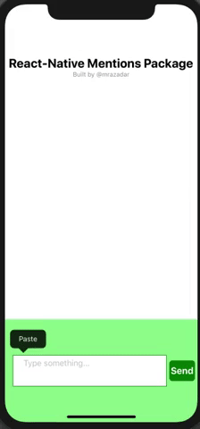
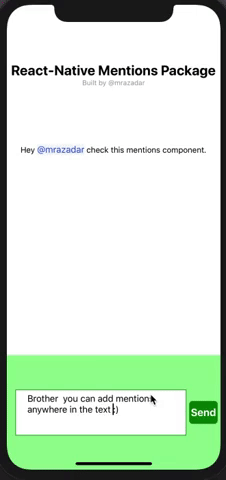
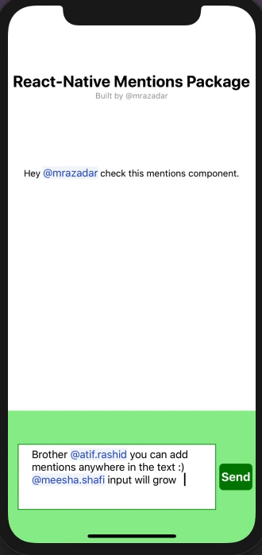
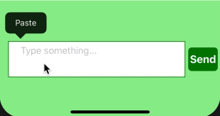
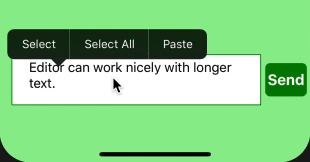

# react-native-mentions-editor [](https://badge.fury.io/js/react-native-mentions-editor)
Mentions TextInput for React Native. Tested on iOS and should work on Android as well. Because it's a plain Javascript base solution with some react-native TextInput support. 
 - Inspiration [react-native-mentions](https://github.com/harshq/react-native-mentions)


## Installation

```yarn add react-native-mentions-editor```
or
```npm install --save react-native-mentions-editor```


## Demo








## Usage

```js
import Editor, { displayTextWithMentions} from 'react-native-mentions-editor';
const users = [ 
    { "id": 1, "name": "Raza Dar", "username": "mrazadar", "gender": "male"},
    { "id": 3, "name": "Atif Rashid", "username": "atif.rashid", "gender": "male"},
    { "id": 4, "name": "Peter Pan", "username": "peter.pan", "gender": "male"},
    { "id": 5, "name": "John Doe", "username": "john.doe", "gender": "male"}, 
    { "id": 6, "name": "Meesha Shafi", "username": "meesha.shafi", "gender": "female"}
];
<Editor 
    list={users} 
    initialValue={this.state.initialValue}
    clearInput={this.state.clearInput}
    onChange={this.onChangeHandler}
    showEditor={this.state.showEditor}
    toggleEditor={this.toggleEditor}
    showMentions={this.state.showMentions}
    onHideMentions={this.onHideMentions}
    ....
/>

const formatMentionNode = (txt, key)=> (
  <Text key={key} style={styles.mention}>
      {txt}
  </Text>
)

<Text style={styles.messageText}>
    {displayTextWithMentions(message.text, formatMentionNode)}
</Text>
```
## How it works 

This component allows you to @mention anywhere in the input value. (Not possible using [react-native-mentions](https://github.com/harshq/react-native-mentions)). 
Work nicely with selection and highlight of text. This component used special mark-up `@[username](id:1)` to differentiate mentions in the input value. 
Whenever input value change the `onChange` callback will be called, with an object containing two properties. 

```js 
this.props.onChange({
    displayText: text,// displayText: "Hey @mrazadar this is good work"
    text: this.formatTextWithMentions(text) //text: "Hey @[mrazadar](id:1) this is good work" 
});
```

`displayText` Will have raw text user will see on the screen. You can see that in the comment. 
`text` Will have formatted text with some markup to parse mentions on the server and other clients. There is a function called `displayTextWithMentions` you can use this function to parse this mark-up with the parser function (Which format the mention node according to formatter function. Check the example app). 

If you want to only parse mentions in the string but don't want to format them you can use this `EditorUtils.findMentions` function to actually parse the mentions in the string. 
This will parse special mark-up `@[username](id:1)` and gives you the exact `positions` and `username` and `id` for that mention. Which you can use for tagging / emailing purposes on the server etc.
You can use this function as: 


```js
import { EU as EditorUtils } from 'react-native-mentions-editor';
EditorUtils.findMentions("Hey @[mrazadar](id:1) this is good work" );

//Check the definition of this function
findMentions: (val) => {
    /**
     * Both Mentions and Selections are 0-th index based in the strings
     * meaning their indexes in the string start from 0
     * findMentions finds starting and ending positions of mentions in the given text
     * @param val string to parse to find mentions
     * @returns list of found mentions 
     */
    let reg = /@\[([^\]]+?)\]\(id:([^\]]+?)\)/igm;
    let indexes = [];
    while (match = reg.exec(val)) {
        indexes.push({
            start: match.index, 
            end: (reg.lastIndex-1),
            username: match[1],
            userId: match[2],
            type: EU.specialTagsEnum.mention
        });
    }
    return indexes;
},
```

## Props {property : type}

**`list: array`** This should be the list of objects to be used as options for the mentions list. **Note** This must contain `id` and `username` properties to uniqely identify object in the list. 

**`initialValue: string`** Use this to initialize TextInput with the initial value. Usage. `initalValue: "Hey @[mrazadar](id:1) this is good work"`

**`clearInput: bool`** When true input will be clear automatically. 

**`onChange: function`** This function will be called on input change event.  

**`showEditor: bool`** Programmatically show/hide editor by using this property. 

**`toggleEditor: function`** Use this to handle `blur` event on input. 

**`showMentions: bool`** Use this property to programmatically trigger the `mentionsList` this will add `@` character in the value.

**`onHideMentions: function`** This callback will be called when user stop tracking of mention. 

**`placeholder: string`** placeholder for empty input. 

**`renderMentionList: function`** If you want to render totally different list. You can use this property to provide alternative mention list renderer. It will be called with certain properties to controll the functionality of list.

```js
renderMentionList Props: object

 mentionListProps= {
    list: props.list, //the default list you passed to this component
    keyword: state.keyword, //keyword to filter the list. e.g. `@m`
    isTrackingStarted: state.isTrackingStarted, // will be true if user started typing `@` 
    onSuggestionTap: this.onSuggestionTap.bind(this), //this function should be called once user press on the list item
    editorStyles: props.editorStyles, // these will be the props passed to the Editor component. 
};

```
**`editorStyles: object`** This object will contain the overriding styles for different nodes. Check the below object to see how you can override styles. 

```js 
editorStyles: {
    mainContainer: {}, 
    editorContainer: {...}, 
    inputMaskTextWrapper: {},
    inputMaskText: {},
    input: {},
    mentionsListWrapper:{},
    mentionListItemWrapper: {} 
    mentionListItemTextWrapper: {},
    mentionListItemTitle: {}
    mentionListItemUsername: {}
}
```

## Example 

Check out the full example in  [example](https://github.com/mrazadar/react-native-mentions-editor/tree/master/example) folder

## License

[MIT License](http://opensource.org/licenses/mit-license.html). © Muhammad Raza Dar